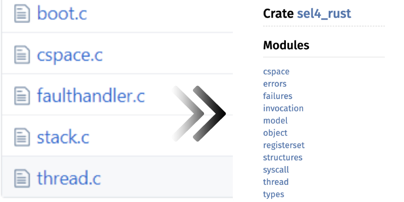
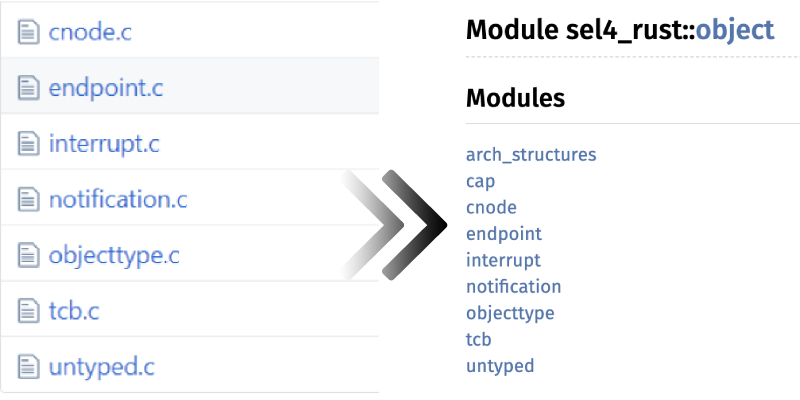
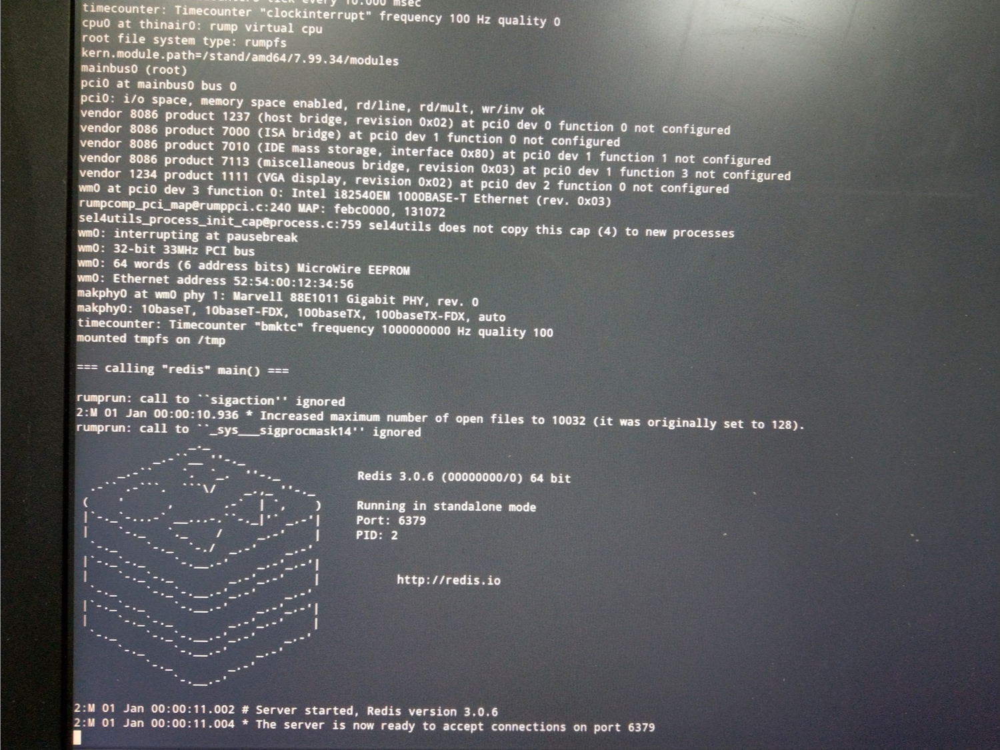

# 结题报告

# 目录

- [小组成员](#小组成员)
- [项目简介](#项目简介)
- [项目背景](#项目背景)
  - [微内核](#微内核)
    - 定义
    - 设计理念
    - 特点
  - [微内核架构举例](#微内核架构举例)
    - [QNX](#QNX)
      - 简介
      - 特点
      - 应用
    - [MINIX](#MINIX)
      - 简介
      - 特点
      - 应用
    - [L4](#L4)
      - 简介
      - 特点
      - 应用
    - [Fuchsia](#Fuchsia)
      - 简介
      - 特点
        - 进程沙箱
        - 访问控制
      - 应用
  - [seL4](#seL4)
    - 简介
    - 形式化验证
  - [Rust](#Rust)
    - 简介
    - 设计
      - 性能
      - 语法
      - 内存安全
      - 内存管理
      - 类型与多态
    - 特点
- [前瞻性分析](#前瞻性分析)
- [理论依据](#理论依据)
  + Rust 提供与底层语言相当的性能
  + Rust 的语法设计和 seL4 使用的 C 语系相似
  + Rust 原生保证内存安全
  + Rust 使用智能指针来进行内存管理
  + Rust 提供更好的类型与多态
  + Rust 的开发生态友好
  + seL4 提供低耦合度的系统结构
  + seL4 通过形式化验证
  + seL4 源代码行数少
+ [技术依据](#技术依据)
  + seL4 内核机制
  	+ Capability
  		+ CNode
  		+ CSpace
  	+ Untyped 内存
  		+ Retype
  	+ 线程
  		+ TCB
  		+ 调度模型
  	+ IPC
  	+ 通知
  + Rust 与 C 交互
  	+ 必要性
  	+ 可行性
  	+ FFI 与 ABI
  	+ 语法
  		+ 调用函数
  		+ 数据类型
  	+ unsafe
- [成果汇报](#成果汇报)
  - 对非平台依赖部分进行改写
    - Kernel
    - Object
  - 将 Rust 特性融入改造过程
    - 系统级编程语言
    - FFI 交互
    - 利用 Rust 引用机制进行内核对象操作
    - 使用 Rust 工具链
  - 改造后内核运行 Redis 演示
- [反思与展望](#反思与展望)

# 小组成员

- 彭定澜
- 陈墨涵
- 沈巍然
- 张德鑫
- 刘旭铠

# 项目简介

我们的项目是*基于 Rust 改造的 seL4 微内核*。

L4 是一种微内核构架的操作系统内核。seL4 是 L4 微内核系列的一种，经 Haskell 形式化验证并实现为 C。

我们计划将它改写为 Rust，进一步提升安全性。

# 项目背景

## 微内核

### 定义

微内核（英语：Microkernel，μ-kernel），又称为微核心，是一种内核的设计架构，由一群尽可能将数量最小化的软件程序组成，它们负责提供、实现一个操作系统所需要的各种机制与功能。这些最基础的机制，包括了底层地址空间管理，线程管理，与行程间通信（IPC）。

### 设计理念

微核心的设计理念，是将系统服务的实现，与系统的基本操作规则区分开来。它实现的方式，是将核心功能模块化，划分成几个独立的行程，各自运行，这些行程被称为服务（service）。所有的服务行程，都运行在不同的地址空间。只有需要绝对特权的行程，才能在具特权的运行模式下运行，其余的行程则在用户空间运行。

### 特点

这样的设计，使内核中最核心的功能，设计上变的更简单。需要特权的行程，只有基本的线程管理，内存管理和进程间通信等，这个部分，由一个简单的硬件抽象层与关键的系统调用组成。其余的服务行程，则移至用户空间。

让服务各自独立，可以减少系统之间的耦合度，易于实现与调试，也可增进可移植性。它可以避免单一组件失效，而造成整个系统崩溃，内核只需要重启这个组件，不致于影响其他服务器的功能，使系统稳定度增加。同时，操作系统也可以视需要，抽换或新增某些服务行程，使功能更有弹性。

因为所有服务行程都各自在不同地址空间运行，因此在微核心架构下，不能像宏内核一样直接进行函数调用。在微核心架构下，要创建一个行程间通信机制，通过消息传递的机制来让服务行程间相互交换消息，调用彼此的服务，以及完成同步。采用主从式架构，使得它在分布式系统中有特别的优势，因为远程系统与本地行程间，可以采用同一套行程间通信机制。

但是因为行程间通信耗费的资源与时间，比简单的函数调用还多；通常又会涉及到核心空间到用户空间的环境切换（context switch）。这使得消息传递有延迟，以及传输量（throughput）受限的问题，因此微核心可能出现性能不佳的问题。

就代码数量来看，一般来说，因为功能简化，微核心使用的代码比集成式核心更少，其源代码通常小于10,000行。

简而言之，微内核架构有如下优点：安全性好、 可移植性好、 灵活性高、 容易debug。但同时也存在着性能会相应降低的问题。

## 微内核架构举例

### QNX

#### 简介

QNX是一个分布式、嵌入式、可规模扩展的实时操作系统。它遵循POSIX.1 (程序接口)和POSIX.2 (Shell和工具)、部分遵循POSIX.1b(实时扩展)。它最早开发于1980年，到现在已相当成熟。QNX是一个微内核实时操作系统，其核心仅提供4种服务：进程调度、进程间通信、底层网络通信和中断处理，其进程在独立的地址空间运行。所有其它OS服务，都实现为协作的用户进程，因此QNX核心非常小巧 (QNX4.x大约为12Kb)而且运行速度极快，且操作系统中的多数功能是以许多小型的task来执行，它们被称为server。这样的架构使得用户和开发者可以关闭不需要的功能，而不需要改变操作系统本身。

#### 特点

QNX特点是稳定性和安全性非常高，实时性也比较好，在数字仪表市场有非常高的占有率，但缺点是兼容性较差，在娱乐系统开发中应用不多，主要是开放性不够，应用生态缺乏。

#### 应用

QNX Neutrino（2001）已经被移植到许多平台并且运行在嵌入式市场中使用的各种现代处理器上，如PowerPC和x86。

QNX为学术界以及非商业用途的用户提供了一个特殊的许可。

QNX的应用范围极广，包含了：控制保时捷跑车的音乐和媒体功能、福特汽车的SYNC 3车载系统、核电站和美国陆军无人驾驶Crusher坦克的控制系统，还有BlackBerry PlayBook和操作系统。

### MINIX

#### 简介

Minix，是一个迷你版本的类Unix操作系统，由塔能鲍姆教授为了教学之用而创作，采用微核心设计。它启发了Linux核心的创作。

#### 特点

全套Minix除了启动的部分以汇编语言编写以外，其他大部分都是纯粹用C语言编写。分为：核心、存储器管理及文件系统三部分。

Minix在设计之初，为了使程序简化，它将程序模块化，如文件系统与存储器管理，都不是在操作系统核心中运作，而是在用户空间运作。至Minix 3时，连IO设备都被移到用户空间运作。
另一个特点，则是Minix主要目的是用于教学，因此代码撰写上极力重视简洁与可读性。

#### 应用

MINIX 3主要应用于小型嵌入式系统和教学，所有2015年之后发布的英特尔芯片都在内部运行着MINIX 3，作为Intel管理引擎(Intel Management Engine)的组件。

### L4

#### 简介

L4是一种微内核构架的操作系统内核，最初由约亨·李德克（Jochen Liedtke）设计，前身为L3微内核。在最开始，L4只是一个由约亨·李德克设计并实现的单一的产品，用于Intel i386上的一个高度优化内核。L4微内核系统由于其出色的性能和很小的体积而开始被计算机工业所认知。随后，L4的系统在多个方面上有了高速的发展，值得提及的是一个更加独立于硬件平台的版本，被称为Pistachio，之后又被移植到了许多不同的硬件构架上。现在已经形成一个微内核家族，包括Pistachio，L4/MIPS，与Fiasco。

#### 特点

L4是第二代微内核接口。一开始L4用汇编语言编写而成。随后，L4开始由高级语言，如C，C++编写，这样使得它可以接口到不同的体系结构中。

L4微内核只将基本的操作功能留在内核中，从而进一步缩小内核的设计，而大大提高了操作系统的兼容性，使得基于微内核的操作系统能模拟其他操作系统的特性

L4微内核提高了操作系统的可扩展性，系统功能可根据需求而增删。

由于系统较小，L4微内核有很好的灵活性和可移植性。同时代码量小也使得其可靠性也较好。
最后，由于微内核设计基于消息传递机制，所以能更容易支持网络通信。

#### 应用

2005年11月，NICTA宣布高通公司在其移动端芯片组上部署NICTA的L4版本。这意味着从2006年底其手机上开始使用L4。2006年8月，ERTOS领导者和新南威尔士大学教授Gernot Heiser开了一家名为Open Kernel Labs（OK Labs）的公司，以支持商业L4用户并进一步开发L4商标使用OKL4品牌，与NICTA密切合作。 2008年4月发布的OKL4版本2.1是第一个普遍可用的L4版本，它具有基于功能的安全性。 2008年10月发布的OKL4 3.0是OKL4的最后一个开源版本。以后更新版本是封闭源代码，且是基于重写以支持称为OKL4 Microvisor的本机管理程序变体。 OK Labs还发布了一个称为OK：Linux的Wombat的后代。 OK Labs还从NICTA获得了seL4的使用权。

OKL4的出货量在2012年初超过了15亿，主要是高通无线调制解调器芯片。其他部署包括汽车信息娱乐系统。

从A7开始的Apple移动应用程序处理器包含一个运行L4操作系统的Secure Enclave协处理器，它基于2006年在NICTA开发的L4嵌入式内核。这意味着L4现在已经在所有iOS设备上发货，2015年的总出货量估计为3.1亿。

### Fuchsia

#### 简介

2016年8月，一个名为"Fuchsia"的项目突然出现在Github上，这是Fuchsia第一次出现在公众面前。Fuchsia取名意为“紫红”，是Google开发的一个新型、现代的操作系统。在它之前，Google公司在操作系统方面的项目只有Android和Chrome OS两个；前者占据了全球移动端操作系统的半壁江山，而后者则主要运行在Google公司推出的Chromebook笔记本电脑上，是一种基于web和云端的操作系统。

与Android和Chrome OS不同的是，这两个操作系统都是基于Linux内核开发的，而Fuchsia则使用了不同于Linux的全新内核——Zircon。Zircon是基于Little Kernel(LK)开发的；LK是一个用于嵌入式设备的小型操作系统，代码很少，设计也比较简单，并且被一些厂家用于Android的bootload。

与Linux不同的地方在于，Zircon采用了微内核架构。在操作系统内核的结构设计上，微内核/宏内核之争由来已久：宏内核主张将内核的主要功能集成在一起运行，效率较高，但功能之间的耦合较紧，如果其中一个部分发生崩溃可能会带来严重的后果。微内核则将内核的大部分功能独立出去，成为模块，内核本身只提供最基础的设施以及模块之间的通信功能，使得模块之间比较独立，便于开发，也具有更好的健壮性。不论这两种架构孰优孰劣，较新的操作系统内核更多的还是采用了微内核架构——Zircon也是其中之一。在Zircon中，内核态的程序只提供内存管理、进程管理、IPC、中断处理等非常基础的功能；而I/O设备管理、文件系统等等功能则放在用户态的模块中进行。

Fuchsia操作系统并不只有一个内核。此系统被设计成了分级的四层架构：最底层是内核Zircon，然后是系统服务层Garnet，接着是用户服务层Peridot，最后是应用层Topaz。Google还为这个系统开发了一套UI设计框架Flutter，它也运行在Topaz层上。

值得注意的是，Garnet层的一部分组件用到了rust编程语言，是少数用到了rust的操作系统项目。用到了rust的组件包括蓝牙模块、xi编辑器的核心xi_core等等。不过，Zircon内核仍然没有使用到rust编程语言，而是主要由C/C++来编写。

Fuchsia的源代码可以被编译到x86和ARM两套指令集，因此有人认为它可能打算统一PC和移动平台。Fuchsia目前并不支持运行在主流的机器上面；但它支持谷歌的Pixelbook和Intel NUC（一种迷你的电脑），还可以在qemu上运行或调试。

总体而言，Fuchsia作为Google开发的操作系统，其目的还不是很明确，推测可能是Google希望有一个摆脱Linux内核的系统，或是希望能创造出一个统一手机/PC的操作系统平台。而且Fuchsia的特点也不是很清晰，没有什么具有革命性的新特点。但是Fuchsia并不成熟，仍然在不断的开发当中；未来或许能成为Android的替代品，所以Fuchsia的前景也不容小觑（实际上Google已经开始着手向Fuchsia添加关于Android的一部分支持）。

#### 特点

##### 进程沙箱

Fuchsia没有传统的“根文件系统”的概念。在Fuchsia中，路径只是一个形式上的字符串，并不一定对应于磁盘上的一个vnode。在一个进程创建时，会给它提供各种资源，这些资源被赋予各种路径。实际上，我们不应该再把这些资源的路径看成是一个统一的文件系统。路径只是这些资源的标签。进程会有一个表，用来存储从标签（即路径字符串）到资源对象句柄的映射关系。有了这样的机制，一个进程在创建时的沙箱可以用任意的方式组装起来。这个组装是必须的，因为进程一开始能访问的资源集合是空的

##### 访问控制

在Fuchsia中，不存在ambient authority. 所有的访问权限需要通过object handle获得。比如说，进程拿到了一个目录的handle，那么它才能访问这个目录下面的文件。这些句柄是在创建进程时赋予的。在传统的操作系统中（包括Windows和Unix），授权是作为一种访问控制机制存在于系统中。在Fuchsia中，授权是作为一种实际的可传递的值（即handle）存在的。

## seL4

### 简介

越大的系统潜在的bug就越多，所以微内核在减少bug方面很有优势，seL4是世界上最小的内核之一。但是seL4的性能可以与当今性能最好的微内核相比。 

作为微内核，seL4为应用程序提供少量的服务，如创建和管理虚拟内存地址空间的抽象，线程和进程间通信IPC。这么少的服务靠8700行C代码搞定。seL4是高性能的L4微内核家族的新产物，它具有操作系统所必需的服务，如线程，IPC，虚拟内存，中断等。

### 形式化验证

seL4一大特色是完全的形式验证。

seL4的实现总是严格满足上一抽象层内核行为的规约，它在任何情况下都不会崩溃以及执行不安全的操作，甚至可以精确的推断出seL4 在所有情况下的行为，这是了不起的。 

研究发现常用的攻击方法对seL4无效，如恶意程序经常采用的缓存溢出漏洞。 

seL4使用面向过程语言Haskell实现了一个内核原型，用它来参与形式验证，最后根据它，用C语言重新实现内核，作为最终内核。

在用C开发内核的过程中，seL4对使用C进行了如下限制： 

1. 栈变量不得取引用，必要时以全局变量代替 
2. 禁止函数指针 
3. 不支持union

对seL4的formal verification（形式验证）分为两步：abstract specification（抽象规范）和executable specification（可执行规范）之间，executable specification和implementation（实现）之间。有两个广泛的方法来进行formal verification： model checking（全自动）和交互式数学证明（interactive mathematical proof ），后者需要手工操作。seL4验证使用的形式数学证明来自Isabelle/HOL，属于后者。

具体来说seL4的形式验证步骤分为以下几步： 

1. 写出IPC、syscall、调度等所有微内核对象（kernel object）的abstract specification（in Isabelle） 
2. 写出如上对象的executable specification（in Haskell），并证明其正确实现了第一步的abstract specification，利用状态机的原理，abstract specification的每一步状态转换，executable specification都产生唯一对应的状态转换。 
3. 写C实现。通过一个SML写的C-Isabelle转换器，和Haskabelle联合形式证明C代码和第二步的Haskell定义语义一致。

seL4的实现被证明是bug-free（没有bug）的，比如不会出现缓冲区溢出，空指针异常等。还有一点就是，C代码要转换成能直接在硬件上运行的二进制代码，seL4可以确保这个转换过程不出现错误，可靠。seL4是世界上第一个（到目前也是唯一一个）从很强程度上被证明是安全的OS。 

实际上OS的verification（验证）早在40年前就开始了，而seL4是振奋人心的，一是它拥有很强的属性（properties）：功能正确性（functional correctness），完整性（integrity）和机密性（confidentiality），二是这些属性已经被形式验证到代码级别，先是C，现在又到了二进制。相比于之前人们对于OS的验证，seL4做得更彻底，但正是借助前人的工作，seL4才能如此优秀。

## Rust

### 简介

Rust是由Mozilla主导开发的通用、编译型编程语言。设计准则为“安全、并发、实用”，支持函数式、并发式、过程式以及面向对象的编程风格。目前，Rust已经有了一个成熟的团队进行开发，并且计划专攻命令行界面、嵌入式设备、网络、WebAssembly四个方向。此外，Rust是开源的编程语言，Rust的编译器基于llvm开发，可以轻易转换成各种平台上的二进制。

### 设计

Rust 的设计目标之一，是要使设计大型的互联网客户端和服务器的任务变得更容易。因此更加强调安全性、存储器配置、以及并发处理等方面的特性。

#### 性能

在性能上，具有额外安全保证的代码会比 C++ 慢一些，但是如果以 C++ 也手工提供保证的情况下，则两者性能上是相似的。

#### 语法

Rust的语法设计，与 C语言和 C++ 相当相似，区块 (block) 使用大括号隔开，流程控制的关键字如 if, else, while 等等。在保持相似性的同时，Rust 也加进了新的关键字，如用于模式匹配 (pattern matching) 的 match (与 switch 相似) 则是使用 C/C++ 系统编程语言的人会相对陌生的概念。尽管在语法上相似，Rust 的语义 (semantic) 和 C/C++ 非常不同。

#### 内存安全

为了提供存储器安全，它的设计不允许空指针和悬空指针。 数据只能透过固定的初始化形态来建构，而所有这些形态都要求它们的输入已经分析过了。 Rust 有一个检查指针生命期间和指针冻结的系统，可以用来预防在 C++ 中许多的类型错误，甚至是用了智能指针功能之后会发生的类型错误。

#### 内存管理

Rust 虽然有垃圾回收系统，但非如 Java 或 .NET 平台的全自动垃圾回收。Rust 1.0已不再使用垃圾回收器，而是全面改用基于引用计数的智能指针来管理内存。

#### 类型与多态

它的类型系统直接地模仿了 Haskell 语言的 type class 概念，并把它称作“traits”，可以把它看成是一种 ad hoc 多态。Rust 的作法是透过在宣告类型变量 (type variable) 的时候，在上面加上限制条件。至于 Haskell 的高端类型变量 (Higher-kinded polymorphism) 则还未支持。

类型推导也是 Rust 提供的特性之一，使用 let 语法宣告的变量可以不用宣告类型，亦不需要初始值来推断类型。但如果在稍后的程序中从未指派任何值到该变量，编译器会发出编译时 (compile time) 错误。 函数可以使用泛型化参数 (generics)，但是必须绑定 Trait。没有任何方法可以使用方法或运算符，又不宣告它们的类型，每一项都必确明确定义。

Rust 的对象系统是基于三样东西之上的，即实现 (implementation)、Trait 以及结构化数据 (如 struct)。实现的角色类似提供 Class 关键字的编程语言所代表的意义，并使用 impl 关键字。继承和多态则透过 Trait 实现，它们使得方法 (method) 可以在实现中被定义。结构化数据用来定义字段。实现和 trait 都无法定义字段，并且只有 trait 可以提供继承，藉以躲避 C++ 的“钻石继承问题”(菱型缺陷)。

### 特点

高性能、可靠、易用。具体而言，如下所示：

Rust在设计上类似C++，遵守“零抽象原则”，也就是会在不损失效率的前提下才会进行抽象。因此，Rust程序往往具有很高的性能，例如用Rust编写的Web框架actix，其实现效率与同类型框架相比排名第一。

Rust又在C++的基础上，提出了所有权与生命周期的概念。所有权的概念在C++中就有提出，主要是针对原生指针带来的潜在问题（引用空指针、忘记释放、多次释放、多线程冲突等）。C++为了解决这些问题而提供了智能指针：将在堆上申请的对象视为一种资源，根据资源是独占还是共享（即资源的所有权），分别提供`unique_ptr`和`shared_ptr`实现自动分配/释放。生命周期则是在软件中非常常见的概念，在这里专指Rust中的对象从生存到销毁所经历的时间。Rust不仅继承了所有权和生命周期的思想，还将这一思想具体化、强制化，也就是Rust程序（在safe的前提下）必须满足编译器规定的关于所有权和生命周期的规定。例如，对象的所有者可以将它的所有权借用给其他的函数，但要求同一时刻只能有多个不可变借用（只读），或是至多一个可变借用（可写），这样便保证了多线程环境下不会有冲突的问题。类似的规定还有很多，这些规定使得Rust相比于C++的放任自由，更强调程序不会出错。

Rust在制作之初就非常关注它的易用性。Rust的文档齐全，编译器友好且能够给出有用的错误信息，并且有完善的包管理/构建工具。Rust还提供了用于编辑器的智能工具，包括自动补全、自动格式化、类型检查等等。

# 前瞻性分析

1. 微内核架构有广大的应用前景，其在分布式，移动端都有很多的应用。且当前内核（如windows，mac）中包含一定的微内核架构理念。而seL4作为当前L4中安全性最好的一个实现，有相当的应用价值。
2. rust的安全性和seL4所倡导的安全性有着很好的匹配，rust可以使seL4这一特性发挥的更好。
3. rust作为一款新的语言，其承接了上世纪C和C++的优点，同时根据需要添加了许多新的特性，应用前景广大。
4. 在seL4中形式验证中，有许多的限制（比如引用变量，函数指针），而这些限制可以通过rust语言的特性规避。

## 理论依据

### Rust 提供与底层语言相当的性能

在性能上，具有额外安全保证的代码会比 C++ 慢一些，但是如果以 C++ 也手工提供保证的情况下，则两者性能上是相似的。

### Rust 的语法设计和 seL4 使用的 C 语系相似

Rust的语法设计，与 C语言和 C++ 相当相似，区块 (block) 使用大括号隔开，流程控制的关键字如 if, else, while 等等。在保持相似性的同时，Rust 也加进了新的关键字，如用于模式匹配 (pattern matching) 的 match (与 switch 相似) 则是使用 C/C++ 系统编程语言的人会相对陌生的概念。尽管在语法上相似，Rust 的语义 (semantic) 和 C/C++ 非常不同。

### Rust 原生保证内存安全

为了提供存储器安全，它的设计不允许空指针和悬空指针。 数据只能透过固定的初始化形态来建构，而所有这些形态都要求它们的输入已经分析过了。 Rust 有一个检查指针生命期间和指针冻结的系统，可以用来预防在 C++ 中许多的类型错误，甚至是用了智能指针功能之后会发生的类型错误。

### Rust 使用智能指针来进行内存管理

Rust 虽然有垃圾回收系统，但非如 Java 或 .NET 平台的全自动垃圾回收。Rust 1.0已不再使用垃圾回收器，而是全面改用基于引用计数的智能指针来管理内存。

### Rust 提供更好的类型与多态

它的类型系统直接地模仿了 Haskell 语言的 type class 概念，并把它称作“traits”，可以把它看成是一种 ad hoc 多态。Rust 的作法是透过在宣告类型变量 (type variable) 的时候，在上面加上限制条件。至于 Haskell 的高端类型变量 (Higher-kinded polymorphism) 则还未支持。

类型推导也是 Rust 提供的特性之一，使用 let 语法宣告的变量可以不用宣告类型，亦不需要初始值来推断类型。但如果在稍后的程序中从未指派任何值到该变量，编译器会发出编译时 (compile time) 错误。 函数可以使用泛型化参数 (generics)，但是必须绑定 Trait。没有任何方法可以使用方法或运算符，又不宣告它们的类型，每一项都必确明确定义。

Rust 的对象系统是基于三样东西之上的，即实现 (implementation)、Trait 以及结构化数据 (如 struct)。实现的角色类似提供 Class 关键字的编程语言所代表的意义，并使用 impl 关键字。继承和多态则透过 Trait 实现，它们使得方法 (method) 可以在实现中被定义。结构化数据用来定义字段。实现和 trait 都无法定义字段，并且只有 trait 可以提供继承，藉以躲避 C++ 的“钻石继承问题”(菱型缺陷)。

### Rust 的开发生态友好

Rust在制作之初就非常关注它的易用性。Rust的文档齐全，编译器友好且能够给出有用的错误信息，并且有完善的包管理/构建工具。Rust还提供了用于编辑器的智能工具，包括自动补全、自动格式化、类型检查等等。

### seL4 提供低耦合度的系统结构

作为微内核，它允许服务各自独立，减少系统之间的耦合度，易于实现与调试，也可增进可移植性。它可以避免单一组件失效，而造成整个系统崩溃，内核只需要重启这个组件，不致于影响其他服务器的功能，使系统稳定度增加。同时，操作系统也可以视需要，抽换或新增某些服务行程，使功能更有弹性。

### seL4 通过形式化验证

seL4的实现被证明是bug-free（没有bug）的，比如不会出现缓冲区溢出，空指针异常等。还有一点就是，C代码要转换成能直接在硬件上运行的二进制代码，seL4可以确保这个转换过程不出现错误，可靠。seL4是世界上第一个（到目前也是唯一一个）从很强程度上被证明是安全的OS。 

### seL4 源代码行数少

seL4靠8700行C代码提供操作系统所必需的一切服务，如线程，IPC，虚拟内存，中断等，容易改写和debug。

## 技术依据

### seL4 内核机制

#### Capability

Capability是用于提供访问系统中对象权限的凭证。seL4系统中所有资源的capability在启动时都被授予根进程。要对任何资源进行操作，用户都需使用libsel4中的内核API，并提供相应的capability。

##### CNode

CNode (capability-node) 是用于储存capability的对象，其中每个CSlot (capability-slot) 可为full或empty，分别对应是否拥有相应capability。CSlot的数量必须为2的整数次方倍。

##### CSpace

CSpace (capability-space) 是线程拥有的capability的集合，由一个或多个CNode组成。根进程的CSpace包含所有由seL4拥有资源的capability，在系统启动时被授予。

#### Untyped 内存

除了内核拥有的少量固定大小的内存，所有物理内存都在用户空间被管理。seL4内核空间外的所有物理内存资源的capability都被转移给根进程。这种capability被称为untyped内存。untyped内存是一块特定大小的连续的物理内存，可能为设备内存或RAM内存，两者在赋予类型时有区别。

##### Retype

untyped capability有调用seL4_Untyped_Retype，用于创建一个新的capability，来获取对untyped内存一部分的使用权，并对其赋予类型。

#### 线程

##### TCB

seL4中的线程对象称为Thread Control Block。包括以下数据：
* 优先级 (0-255)
* 寄存器状态和浮点数环境
* CSpace capability
* VSpace capability (与虚拟内存有关)
* endpoint capability (用于发送错误信息)
* reply capability

##### 调度模型

seL4使用基于优先级的循环调度器。调度器会找出优先级最大的未被阻塞的线程来执行。若有多个优先级相同的进程，将会以先到先得的顺序顺次执行。为了提供确定性的调度，可以将使用域调度。域调度是非抢占式的，线程可以与域关联，这样这些线程只有当此域是活跃时会被调度，而跨域IPC只有当域切换时才会执行。

#### IPC

作为微内核，seL4大量使用进程间通信。在seL4中，IPC借助称为endpoint的内核对象。endpoint对象上的调用可以收发同步的IPC消息。seL4提供了seL4_Send、seL4_NBSend、seL4_Recv、seL4_Call等系统调用在endpoint上进行进程间通信，调用这些系统调用需要相应的capability。IPC可以用于传输数据，还可以用于进程间的capability转移。由于微内核对IPC的高依赖性，seL4提供了一套优化的IPC方法。

#### 通知

seL4借助通知对象的capability进行异步的信号收发。通知对象包含一组二元信号量，和等待通知的线程队列。通知对象可以为Waiting、Active、Idle三种状态。seL4提供了seL4_Signal、seL4_Wait、seL4_Poll系统调用以进行异步的通信。

### Rust 与 C 交互

#### 必要性

很多大型的软件项目都是使用多种程序设计语言写成的，比如操作系统往往是用汇编和C写成的，而web项目往往有前端和后端之分并使用了不同的语言。将不同的语言混合在一起使用，并不是什么坏事；恰恰相反，不同的编程语言往往有着不同的特性，“术业有专攻”，混合在一起可能能达到更好的效果。

seL4的内核源码也是用C和汇编写成的。(https://github.com/seL4/seL4) 如果我们需要用rust改写这个内核，有两种可能的方案，一是保留一部分C的内容的同时改写另一部分；二是将所有C代码用rust改写。第二种方案在难度上比较大，并不一定能实现，而且很多底层操作（比如boot和内存管理）使用C比unsafe Rust要更方便和自然。而如果在保留一部分C的内容的前提下用Rust改写，就会需要Rust与C的交互。

需要Rust与C交互还有另外一个原因，就是操作系统需要一定的应用程序接口(API)。L4是一个通用性的操作系统内核，在改写它的时候我们必须要保留好内核和其上的应用程序的接口。这种接口不仅仅是包括系统调用，还包括以库的形式提供的API。C语言是远比Rust用得广泛的多的系统编程语言，因此操作系统不可避免地与C应用程序打交道。如果我们能够以C语言可以直接调用的形式给出API，就可以把很多建立在L4上的应用程序移植到改写的代码上来。

#### 可行性

Rust与C交互的可行性有两方面，一是语言层面上的可行性，二是工具层面上的可行性。

语言层面上的可行性，也就是在代码中进行交互的语法细节，在后面会详细给出，这里就不再赘述了。

工具层面上的可行性，就是说借助已有的构建工具可以把Rust代码和C代码放在一起进行编译、链接变成可执行的程序。由于一些历史原因，C语言不存在统一的管理和构建工具，在Unix系统上非常常见的构建工具就是Make。seL4使用了一种跨平台的构建工具CMake，它可以根据所用平台的不同，生成对应的makefile或其他文件。而Rust语言存在一个统一的包管理工具cargo，它同时也被用作Rust程序的构建。

可以看到，C和Rust在构建的工具上存在巨大的差异。所幸的是，Make和CMake足够灵活，我们还是可以比较容易地实现Rust和C程序的构建。如果使用Make的话，因为makefile像shell一样可以随意调用系统中的命令，所以可以直接用cc和rustc进行编译（比如`$(CC)` `$(RUSTC)`），再进行链接等操作。如果使用CMake的话，也有一些办法把cargo集成到CMake中去。https://stackoverflow.com/questions/31162438/how-can-i-build-rust-code-with-a-c-qt-cmake-project 提供了把cargo作为一个外部项目衔接到CMake中去的方案；https://github.com/AndrewGaspar/cmake-cargo 是一个可以把cargo中的包(叫做crate)集成入已有的CMake项目的工具。借助这些办法，在seL4已有代码和CMakeList的基础上添加和改写Rust程序就变得可行了。

#### FFI 与 ABI

FFI是外语言函数接口(Foreign Function Interface)的简称。就像它的名字一样，FFI用于在一个程序语言的函数中调用另一个语言的函数。这一功能保障了不同程序语言之间能够自由地交互，从而可以把不同语言的代码像积木一样搭建起大型程序。

在操作系统的层面上，有时还需要ABI。ABI是应用二进制接口(Application Binary Interface)的简称。ABI是从底层细节的层面给出应用程序和操作系统、应用程序之间等等进行交互的具体规范。统一的ABI是实现FFI的基础，保证不同语言程序编译出的二进制机器码在数据类型、调用约定、系统调用方法等层面上保持一致，就保证了不同语言的程序进行互相调用的可行性。但由于ABI较为底层，所以往往特定的操作系统/体系结构上有特定的ABI。

由于C作为系统编程语言的地位，很多ABI是以C ABI的形式给出的：即为C语言提供机器码层面上的规范，而让其他语言遵守这个相同的规范。Rust也是这样，当需要调用C函数或为C函数所调用时，通过特定的语法启用C ABI，保证编译出来的函数可以为C语言或其他语言所调用。

#### 语法

##### 调用函数

在Rust官方教程the book中简短地提及了调用C函数的FFI语法(https://doc.rust-lang.org/book/ch19-01-unsafe-rust.html#calling-an-unsafe-function-or-method)。

粗略地说，Rust语言提供了`extern`关键字，用来标识相关的函数能够用于同其他语言进行交互。当我们需要把Rust函数拿给C程序使用的时候，可以在函数定义前面加上`extern "C"`，并使用`#[no_mangle]`标识来保证编译器不会修改函数的名字。示例的代码如下：

```rust
fn main() {
#[no_mangle]
pub extern "C" fn call_from_c() {
    println!("Just called a Rust function from C!");
}
}
```

而如果要把C程序拿给Rust使用，会稍微麻烦一点。我们需要用`extern "C"`标识出一个块，在块内给出C函数的声明；由于C语言对代码的限制很少，不像Rust为了保证程序的安全性而做出了很多限制，直接调用C函数可能会扰乱Rust的这些限制。因此，Rust规定，调用C函数时必须在unsafe块中进行。示例的代码如下：

```rust
extern "C" {
    fn abs(input: i32) -> i32;
}

fn main() {
    unsafe {
        println!("Absolute value of -3 according to C: {}", abs(-3));
    }
}
```

##### 数据类型

Rust和C在数据类型上存在一定的区别。然而，很多数据类型是可以对应起来的。

- 基本数据类型：`std::os::raw`库中给很多C中的基本数据类型做了对应，包括整数、浮点数和字符类型。不过很多基本的数据类型从名字上就可以对应起来，如（通常而言）32位有符号整数类型`i32`直接对应`int`或者`int32_t1`，无符号的`u32`直接对应`unsigned int`或者`uint32_t`。
- 字符串：Rust中的字符是Unicode字符，不能直接对应到C中的字符。Rust中的字符串结构与C风格的字符串结构更是大相径庭。为此，`std::ffi`库中提供了两种不同的字符串类型`CStr` `CString`，前者用于从C到Rust转换，后者用于从Rust到C转换，具体细节可以参考https://doc.rust-lang.org/stable/std/ffi/index.html 。
- 数组与指针：C语言的指针和Rust中的裸指针(raw pointer)是直接对应的，比如`*mut c_uint`对应`uint32_t *`。由于裸指针不受所有权等规范的限制，所以也需要在`unsafe`块中进行操作。C语言在函数中传递数组其实就是传递指针，而要转换成Rust中的数组切片可以使用`slice::from_raw_parts`函数转换。`void*`指针可以利用`std::ffi::c_void`对应`void`来实现。
- 结构体和枚举体：C语言和Rust都有结构体。从ABI层面去看，结构体其实只是将若干类型的数据按照一定的顺序存在一起，因而约定了结构体的内存布局就能把C和Rust的结构体对应起来。为了让Rust中的结构体的内存布局遵守C ABI，需要使用`#[repr(C)]`进行标识，之后即可直接互相传递。枚举体也是同样使用这个标识。
- 复杂数据类型：对于比较复杂的数据类型，比如包装了高级数据结构的结构体，可以在不暴露内部结构的前提下使用指针进行传递。具体而言，我们在Rust中定义一个具体的结构体`XXX`，并给出几个传递指针进而操作这个结构体的函数，并在C语言中声明`struct XXX;`而不给出其内部结构(这似乎叫做不透明数据类型)，通过给那些操作函数传递指针就能达到传递复杂数据类型的效果。

#### unsafe

可以看到，由于C语言自身的性质使然，它对于很多“危险”的操作，包括可能越界的数组访问、对任意指针进行解引用、在各种类型之间进行转换等等，都没有任何的限制，而是在C语言标准中规定了某些情况属于“未定义行为(Undefined Behavior)”。但Rust在设计之初就希望对很多会带来不可预知后果的行为进行编译期的限制，这就带来了C和Rust的不同。为了实现Rust与C的交互，需要将很多“危险”的行为放在unsafe块中，标识出“这是不安全的”。

那么，是不是与C交互的行为就是不安全的、需要尽量避免的呢？并不是这样的。在官方的文档中(https://doc.rust-lang.org/stable/nomicon/safe-unsafe-meaning.html )指出，Rust其实是分为了safe和unsafe两部分，unsafe代表的意义是由程序员自己而不是编译器来保证程序的安全。在很多情况下，unsafe是难以避免的，因为编译器的能力是有限的。有一个典型的例子：编写将可变切片`&mut [T]`切分为两块的函数`split_as_mut`，这在safe Rust中无法实现，因为可变的引用只能转移而不能存在两个。这体现出了Rust编译器的能力有限：因为切分后的两片是不相交的，各自成为一个可变引用并没有什么问题。为了让编译器信任我们能保证程序的安全，我们引入unsafe块来实现这个函数：

```rust
fn split_at_mut(slice: &mut [i32], mid: usize) -> (&mut [i32], &mut [i32]) {
    let len = slice.len();
    let ptr = slice.as_mut_ptr();
    assert!(mid <= len);
    unsafe {
        (slice::from_raw_parts_mut(ptr, mid),
         slice::from_raw_parts_mut(ptr.offset(mid as isize), len - mid))
    }
}
```

类似地，在标准库中存在着一些利用了unsafe实现的函数（比如，为了能够高效地使用所有权关系模糊地链表数据结构，需要引入unsafe块），这并不意味着它们就是不安全的。Rust允许我们在函数内部使用unsafe块，而把这个函数作为safe函数来调用。

在与底层打交道的操作系统里，不安全的行为比比皆是。除了和操作系统中的C代码交互以外，内存的分配和管理等操作本身也是明显“不安全”的。在用Rust改写曹祖系统内核的过程中，我们会不可避免地和unsafe打交道（比如纯利用Rust编写的操作系统Redox，它的代码实现里就出现了很多的unsafe）。

## 成果汇报

### 对非平台依赖部分进行改写

我们注意到，改写平台依赖部分是一种重复劳动的行为，并且其中有很多不适合进行 Rust 改造的代码。基于减量改写和不重复造轮子的思想，我们只对 seL4 的核心代码、即它的一些非平台依赖部分进行了改写。对于一些不得不使用 C 代码的场合，我们通过 Rust 与 C 的交互机制对源代码进行了低成本调用。

#### Kernel

我们对 seL4 的 Kernel 部分进行了改写，并调整了 seL4 的文件结构，外联了部分不适合使用 Rust 的 C 代码，最终获得了 seL4_Rust 的主体。这一部分主要是部分 Capability、Stack、Thread 等内核的基础建筑。



#### Object

我们对 seL4 的 Object 部分进行了改写。这一部分补完了 Capability，提供了 TCB 和 Untyped 内存等重要的内核机制。



### 将 Rust 特性融入改造过程

我们的改写工作不是单调的翻译工作。在改写过程中，我们一边工作、一边学习 Rust 知识，尽可能将 Rust 特性融入改造后的代码。

#### 系统级编程语言

Rust 是一门系统级编程语言，可以直接对底层进行操作。我们利用这一特点，在改写时避免了使用更高级语言编程时带来的抽象代价。

#### FFI 交互

通过使用外语言函数接口，我们从 Rust 导出符号链接，实现 C 源码与改造后的 Rust 代码的交互，避免了改写一些不适宜或不需要改写的 C 源码的困难。

#### 利用 Rust 引用机制进行内核对象操作

我们在保证 C 的接口的前提下，利用 Rust 中的引用机制进行内核对象操作，极大减少了操作时的复制开销，并提升了安全性。

#### 使用 Rust 工具链

我们积极使用 Rust 社区提供的工具链，例如类型推断和检查、编译驱动开发、代码规范、自动格式化等，对代码的安全性、规范性进行了指导、检验和引导修复。

### 改造后内核运行 Redis 演示

改写完成后，我们成功编译并运行了内核，并在其上运行了一个 Redis Server，证明了改写的可靠性。



## 反思与展望

在本次实验中，我们小组的成员用 Rust 改写了 seL4 的核心代码，学习了利用 Rust 编写操作系统内核，锻炼了大型项目的编程和写作能力。

我们的不足之处在于，限于技术水平和开发中的 seL4 自身存在的一些问题，没有将整个内核都进行改造；并且受到 FFI 限制，不能很好地利用 Rust 内存安全的特性。

本次实验的结果再次证明了 Rust 的种种特性对于编程效率和安全性的益处，并为以后 Rust 在 seL4 上的应用奠定了基础，对代码移植和升级提供了保障。